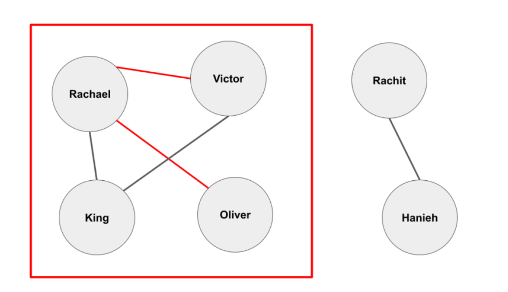

# UNIX Network Programming

## Project Description

Social networks are nowadays in every moment of our lives. The information built upon interactions among people has led to different types of applications. Crowdsourced apps such as Uber, Lyft, Waze use information for navigation purposes. Other apps such as dating apps provide matching algorithms to connect users who share similar behaviours and increase their compatibility chances for future success. In this project we shall implement a simplified version of a matching app that'll help us understand how matching systems work in the real world. Specifically, you'll be given a network topology consisting of social connections between different users in the network. This will consist of nodes representing users and the edges between them. Beside social network topology, you will also be given a database consisting of compatibility test scores. This database will be in plain text and consist of multiple key (the user), value (the corresponding score) pairs.

In this project, you will implement a model of a social matching service where two clients issue a request for finding their compatibility. This request will be sent to a Central Server which in turn interacts with three other backend servers for pulling information and data processing. The Central server will connect to the Topology server (server T) which has the user social network information. Central server has to connect as well to the Score server (server S) which stores the compatibility scores for each user. Finally, the server will use the network topology and scores to generate a graph that connects both users, and provide the smallest matching gap between them. The procedure to complete this task is provided in phase 2’s description. Both the matching gap and the graph generated will be sent back to both clients. 

## Work Done

Phase 1A: Establish connections between Clients and Central server

Phase 1B: Establish connections between Central and all other backend servers 

Phase 2: Central communicates with ServerT, ServerS and ServerP to get matching gap 

Phase 3: Central server sends the information to Clients for display 

Phase 4: Client B provides 2 usernames for matching with Client A username 

## Source Files

**clientA.cpp**: Input username through command line arguments. Connect with the Central server using a TCP socket over a dynamically allocated port. Send the username to Central server over the TCP connection for finding the compatibility. Receive the display string and prints it.

**clientB.cpp**: Input username/usernames through command line arguments. Connect with the Central server using a TCP socket over a dynamically allocated port. Send the username/usernames to the Central server over the TCP connection for finding the compatibility. Receive the display string and prints it. To implement the optional part, it checks the number of command line inputs and communicate with the Central server accordingly.

**central.cpp**: Set up 2 TCP sockets and 1 UDP socket on statically assigned ports. First setup TCP connection with clientA and clientB and receive usernames for further processing. Send the usernames to ServerT using the UDP socket. Receive the topology information (adjacency matrix, nodes_list) and the username mappings to be forwarded to ServerS. Send the related nodes information (nodes_list) to ServerS using the UDP socket and receive the scores information (scores_list, names_list) in return. Send the topology information (adjacency matrix, nodes_list), scores information (scores_list, names_list) and the username mappings to ServerP using the UDP socket to find the compatibility. Receive the compatibility information from ServerP and communicate the output messages to the clients.

**serverT.cpp**: Set up 1 UDP socket on statically assigned port. Use the class EdgeList to read the edgelist.txt file and form the name mappings and adjacency list. Includes utility functions to find the index of a given name, merge to nodes list and run Breadth First Traversal. Once Central server sends the 2 usernames over the UDP socket. serverT finds the related nodes two both the users and constructs an adjacency matrix to be forwarded to the Central server. It also returns the index of the user names in the nodes_list to the Central server for sending to serverP.

**serverS.cpp**: Set up 1 UDP socket on statically assigned port. Use the class ScoreList to read the scores.txt file and form 2 vectors (names_vec and scores_vec). Vectors are sorted based on the lexicographic order of the names. Receive the nodes_list from the Central server and find the corresponding scores and names of nodes. Send the information back to the Central server.

**serverP.cpp**: Set up 1 UDP socket on statically assigned port. Once all data from Central server is received start processing. Firstly, use the scores_list and adjacency matrix to form a weighted adjacency matrix to run Dijkstra's shortest path algorithm. Use the index mappings of usernames from Central server to set the source and target nodes for Dijkstra's algorithm. After the algorithm check if a path exists or not, if a path exists use the parent vector to generate a string with the intermediate nodes connecting the source and target nodes. Generate 2 output strings to be sent back to Central.

## Messages Exchanged

### ServerT Terminal:
The ServerT is up and running using UDP on port 21499
The ServerT received a request from Central to get the topology.
The ServerT finished sending the topology to Central.

### ServerS Terminal:
The ServerS is up and running using UDP on port 22499
The ServerS received a request from Central to get the scores.
The ServerS finished sending the scores to Central.

### ServerP Terminal:
The ServerP is up and running using UDP on port 23499
The ServerP received the topology and score information.
The ServerP finished sending the results to the Central.

### Central Terminal:
The Central server is up and running.
The Central server received input=Brooke from the client using TCP over port 25499.
The Central server received input=Jordan from the client using TCP over port 26499.
The Central server sent a request to Backend-Server T.
The Central server received information from Backend-Server T using UDP over port 24499.
The Central server sent a request to Backend-Server S.
The Central server received information from Backend-Server S using UDP over port 24499.
The Central server sent a processing request to Backend-Server P.
The Central server received the results from backend server P.
The Central server sent the results to client A.
The Central server sent the results to client B.

### ClientA Terminal:
The client is up and running.
The client sent Brooke to the Central server.
Found compatibility for Brooke and Jordan:
Brooke --- Benjamin --- Alexis --- Jordan
Matching gap: 0.08

### ClientB Terminal:
The client is up and running.
The client sent Jordan to the Central server.
Found compatibility for Jordan and Brooke:
Jordan --- Alexis --- Benjamin --- Brooke
Matching gap: 0.08

## Idiosyncrasy

The code covers all the important aspects mentioned in the project description but does not cover the following edge cases and the output may return error/garbage value depending on the input:
- As mentioned in the discussion, the code is based on the assumption that all nodes are connected to atleast one other node i.e., they are a part of the edgelist.txt file. The code fails when even a single node is absent in the edgelist.txt file but included in the scores.txt file. This will lead to an incorrect output compatibility value.
- The code fails when the both inputs are same. In this case as a fail safe, serverP will notify that both inputs are same and terminate itself. But the other servers will keep running and have to be terminated along with the clients.
- As mentioned in the discussion, the code is based on the assumption that all input values are correct that is the usernames are part of both the edgelist.txt and scores.txt files. The code will return a faulty value when an input username is not part of the either of the files.
- The code has been extensively tested on the sample data set provided as well as the test set posted on Piazza. It runs error free and seamlessly if the above points are taken care of when entering the input usernames.

## Reused Code

From Beej’s Guide to Network Programming
central.cpp -> SetupUDPSocket(const char *port)

From Beej’s Guide to Network Programming
central.cpp->SetupTCPSocket(const char *port)

From GeeksforGeeks
serverT.cpp->class Graph

From GeeksforGeeks
serverT.cpp->Graph::BFS(int componentNum, int src, int visited[])

From GeeksforGeeks
serverP.cpp->FindCompatibility(int num_nodes, double **&weighted_adjacency_matrix, std::vector<std::string> &names_list, int src, inttarget)

