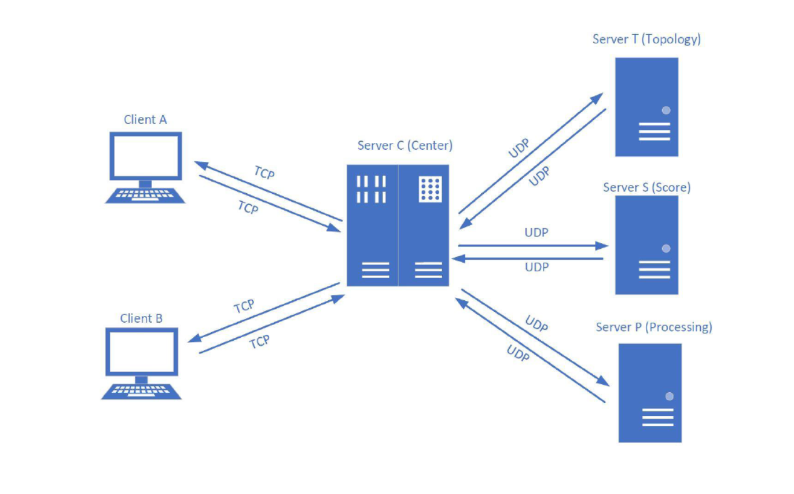

# UNIX Network Programming

## Project Description

Social networks are nowadays in every moment of our lives. The information built upon interactions among people has led to different types of applications. Crowdsourced apps such as Uber, Lyft, Waze use information for navigation purposes. Other apps such as dating apps provide matching algorithms to connect users who share similar behaviours and increase their compatibility chances for future success. In this project we shall implement a simplified version of a matching app that'll help us understand how matching systems work in the real world. Specifically, you'll be given a network topology consisting of social connections between different users in the network. This will consist of nodes representing users and the edges between them. Beside social network topology, you will also be given a database consisting of compatibility test scores. This database will be in plain text and consist of multiple key (the user), value (the corresponding score) pairs.

In this project, you will implement a model of a social matching service where two clients issue a request for finding their compatibility. This request will be sent to a Central Server which in turn interacts with three other backend servers for pulling information and data processing. The Central server will connect to the Topology server (server T) which has the user social network information. Central server has to connect as well to the Score server (server S) which stores the compatibility scores for each user. Finally, the server will use the network topology and scores to generate a graph that connects both users, and provide the smallest matching gap between them. The procedure to complete this task is provided in phase 2’s description. Both the matching gap and the graph generated will be sent back to both clients. 

